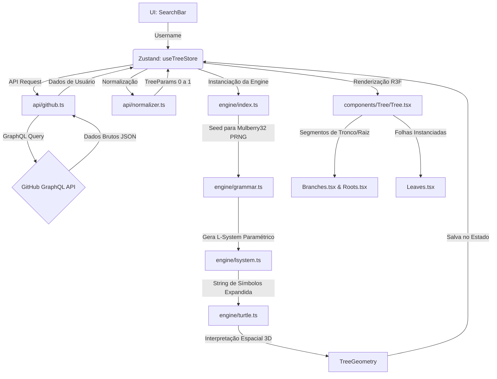

# GitForest 🌳 — Codebase Map & Architecture

Este documento serve como mapa arquitetural e guia de referência rápida para desenvolvedores e Inteligências Artificiais. Seu objetivo é permitir a compreensão profunda da estrutura do projeto GitForest, reduzindo o consumo de tokens ao evitar a necessidade de ler arquivo por arquivo.

> [!IMPORTANT]
> **Regra de Manutenção do Arquivo:** Qualquer IA ou desenvolvedor que realizar modificações estruturais, lógicas ou visuais significativas nesta base de código **DEVE** atualizar este arquivo e adicionar uma nova entrada no **Log de Versões e Alterações** localizado no final do documento.

---

## 🧭 Visão Geral do Projeto

**GitForest** é um visualizador 3D interativo construído em React, TypeScript e Three.js (via React Three Fiber). A aplicação consome dados públicos da API GraphQL do GitHub e gera uma árvore procedural (representando a atividade do usuário) utilizando um motor de **L-System (Sistema de Lindermayer) Paramétrico Estocástico**.

### Como a árvore é construída (Mapeamento Biológico dos Dados):
*   **Tronco (Altura e Diâmetro):** Relacionados ao número total de repositórios do usuário e à idade da conta (altura), além do total de contribuições históricas (diâmetro/espessura).
*   **Raízes:** A profundidade e quantidade de raízes variam conforme a idade da conta no GitHub.
*   **Galhos (Branches/Repositórios):** Cada repositório (até os top 30 mais relevantes ordenados por estrelas) gera um galho principal.
    *   *Espessura do Galho:* Proporcional ao número de commits + estrelas do repositório.
    *   *Comprimento do Galho:* Baseado na idade do repositório e volume de commits.
    *   *Sub-ramificações:* Forks geram ramificações secundárias a partir do galho principal.
    *   *Galhos Mortos (Secos):* Repositórios inativos sem atualização (push) há mais de 3 anos secam, perdendo a folhagem.
*   **Folhas (Linguagens de Programação):** Cada folha assume a cor oficial da linguagem predominante no repositório.
    *   *Densidade de Folhas:* Baseada na atividade recente do repositório (último push) combinada com commits.

---

## 🛠️ Stack Tecnológico

*   **Framework Principal:** React + TypeScript (com Vite)
*   **Engine 3D:** Three.js com `@react-three/fiber` (R3F) e `@react-three/drei`
*   **Pós-processamento:** `@react-three/postprocessing` (Bloom + Vignette)
*   **Estado Global:** Zustand
*   **API:** GitHub GraphQL API v4 (com cache local no `localStorage` de 1 hora)

### 🎨 Direção de Arte

Havia um conflito documentado aqui: o stack dizia "futurista, dark, glassmorphism
e neon" enquanto a cena 3D sempre foi *golden hour* estilo Firewatch. A v1.1.0
resolveu a favor da paisagem naturalista. A regra atual é:

*   **Cena 3D:** paisagem estilizada low-poly, facetada, com hora do dia
    definida por preset (`src/world/atmosphere.ts`). Sem texturas — toda a cor
    do terreno é vertex color.
*   **UI 2D (overlay):** permanece dark com glassmorphism, para contrastar com a
    cena e manter legibilidade sobre qualquer preset.

---

## 🔄 Fluxo de Dados e Pipeline de Geração

O ciclo de vida da busca e renderização segue a seguinte sequência linear:



---

## 📁 Estrutura de Diretórios e Arquivos

### 📂 Raiz do Projeto
*   [index.html](file:///d:/Projetos%20pessoais/gitforest/index.html): Estrutura HTML inicial contendo a montagem do container do React.
*   [.env](file:///d:/Projetos%20pessoais/gitforest/.env): Configuração de variáveis de ambiente. Pode conter `VITE_GITHUB_TOKEN` como fallback de Token de Acesso Pessoal (PAT) para evitar limites de rate limit da API pública.
*   [package.json](file:///d:/Projetos%20pessoais/gitforest/package.json): Dependências do projeto (React Three Fiber, Zustand, Three, etc.).
*   [tsconfig.json](file:///d:/Projetos%20pessoais/gitforest/tsconfig.json): Configuração do TypeScript.

---

### 📂 `src/` (Código Fonte)
*   [main.tsx](file:///d:/Projetos%20pessoais/gitforest/src/main.tsx): Ponto de entrada do React que inicializa a aplicação no DOM.
*   [App.tsx](file:///d:/Projetos%20pessoais/gitforest/src/App.tsx): Componente pai que orquestra o Canvas 3D (R3F), a UI de overlay, o controle de órbita (`OrbitControls`) e as animações de crescimento da árvore.
*   [App.css](file:///d:/Projetos%20pessoais/gitforest/src/App.css): Estilos globais e efeitos de tela de boas-vindas do container principal.

#### 📂 `src/api/` (Integração com o GitHub)
*   [github.ts](file:///d:/Projetos%20pessoais/gitforest/src/api/github.ts):
    *   Realiza chamadas HTTP POST para o endpoint GraphQL do GitHub.
    *   Contém a query estruturada `USER_QUERY` otimizada para buscar informações de usuário, top 30 repositórios com suas linguagens detalhadas, histórico de commits e calendário de contribuições anual.
    *   Implementa cache no `localStorage` com prefixo `gitforest_cache_` e TTL (Time To Live) de 1 hora.
*   [forest.ts](file:///d:/Projetos%20pessoais/gitforest/src/api/forest.ts):
    *   Descoberta do grafo social sem login: `following ∩ followers` como definição honesta de amizade, com fallback documentado para `following` quando a interseção é pequena demais para ser confiável.
    *   Query enxuta de perfil (12 repositórios, sem o calendário dia a dia) em lotes por aliases GraphQL. **`PROFILE_BATCH_SIZE = 4` é medido, não chutado:** lotes de dez com `contributionsCollection` estouram em 504.
*   [topUsers.ts](file:///d:/Projetos%20pessoais/gitforest/src/api/topUsers.ts):
    *   Lê o ranking de contribuidores públicos por país publicado em `gayanvoice/top-github-users`, direto de `raw.githubusercontent.com` (que envia CORS aberto e dispensa autenticação).
    *   O **catálogo de países é embutido**, não buscado: a listagem de diretório da API do GitHub devolve 138 KB e chegou ao navegador cortada, como um `TypeError: Failed to fetch` sem status.
*   [normalizer.ts](file:///d:/Projetos%20pessoais/gitforest/src/api/normalizer.ts):
    *   Converte a resposta bruta do GitHub em parâmetros matemáticos normalizados de `0` a `1` (`TreeParams`).
    *   Utiliza escalas logarítmicas (`logNormalize`) para atenuar as diferenças de escala gigantescas entre usuários (ex: perfis com 10 estrelas vs 10.000 estrelas).
    *   Controla o limiar de inatividade (galhos mortos) configurado para 3 anos sem novas alterações (`pushedAt`/`updatedAt`).

#### 📂 `src/store/` (Estado Global)
*   [useTreeStore.ts](file:///d:/Projetos%20pessoais/gitforest/src/store/useTreeStore.ts):
    *   Gerencia o estado global (`status`, `username`, `treeParams`, `treeGeometry`, `error`, `githubToken`) com Zustand.
    *   Armazena e lê o Token do GitHub do `localStorage` (`gitforest_token`), caindo de volta para a variável de ambiente `.env` se disponível.
    *   Dispara o fluxo síncrono/assíncrono `fetchAndGenerate` ao pesquisar um usuário.
*   [useInteractionStore.ts](file:///d:/Projetos%20pessoais/gitforest/src/store/useInteractionStore.ts):
    *   Gerencia o estado de interação 3D e seleção (`hoveredBranchIndex`, `selectedBranchIndex`, `hoveredRepoName`, `interactionSource`).
    *   Sincroniza os eventos de hover/click entre a cena 3D e o painel bidimensional lateral (`InfoPanel`).
*   [useSceneStore.ts](file:///d:/Projetos%20pessoais/gitforest/src/store/useSceneStore.ts):
    *   Estado **visual** do cenário (atmosfera, espécie, estação), separado do estado de dados, persistido no `localStorage`.
    *   Os três eixos têm custos diferentes, e a store existe em parte para deixar isso explícito: atmosfera e estação são uniforms (instantâneos); **espécie muda a gramática do L-System e exige regeneração** — por isso `App` observa essa chave e chama `useTreeStore.regenerate()`.

#### 📂 `src/world/` (Paisagem Procedural)

Módulo puro (sem React, sem Three no caso do ruído). Introduzido na v1.1.0.

*   [noise.ts](file:///d:/Projetos%20pessoais/gitforest/src/world/noise.ts):
    *   Simplex 2D seedado por Mulberry32, mais os agregadores `fbm2D` (colinas arredondadas) e `ridged2D` (cristas afiadas, usado nos morros distantes).
    *   **Regra:** nada na paisagem pode usar `Math.random()`. Mesma seed, mesma cena.
    *   Não existe contraparte em GLSL — o deslocamento do terreno é 100% CPU, de propósito (replicar hash de float entre JS e GLSL é frágil, e a malha é estática).
*   [terrain.ts](file:///d:/Projetos%20pessoais/gitforest/src/world/terrain.ts):
    *   **Fonte única de verdade da altura do solo.** `heightAt(x, z)` é consultada pela malha, pela grama, pela árvore e pela câmera — se cada um calculasse a sua própria altura, a cena desmontaria.
    *   `normalAt`, `slopeAt` e `colorAt` (altitude + declive + curvatura como oclusão-ambiente).
    *   `ClearingSite`: achata o terreno sob cada árvore, interpolando em direção ao relevo bruto do próprio centro da clareira.
    *   `buildGeometry()`: plano deslocado → cor por vértice → `toNonIndexed()` → cor achatada por face → `computeVertexNormals()`. É esse pipeline que produz o facetado low-poly.
    *   `getTerrain()`: singleton compartilhado. Recriar o terreno por componente custaria centenas de milissegundos e abriria espaço para divergência.
*   [atmosphere.ts](file:///d:/Projetos%20pessoais/gitforest/src/world/atmosphere.ts):
    *   Presets de hora do dia (`amanhecer`, `goldenHour`, `meioDia`, `noite`) que definem **juntos** céu, luzes, neblina, bloom, cor dos morros e tingimento da grama.
    *   ⚠️ `fog.far` precisa ficar abaixo de `TerrainConfig.size / 2`, senão a borda da malha detalhada fica visível.
*   [forestLayout.ts](file:///d:/Projetos%20pessoais/gitforest/src/world/forestLayout.ts):
    *   Posiciona as conexões em dois anéis por espiral de ângulo áureo, com a distância radial representando a força do laço. Anel regular leria como cerca; ângulo áureo nunca repete alinhamento.
*   [countryLayout.ts](file:///d:/Projetos%20pessoais/gitforest/src/world/countryLayout.ts):
    *   Mapa completo de posições do ranking de um país, calculado **de uma vez** para todas as centenas de contas — é matemática pura, e ter o mapa pronto é o que permite ao carregamento sob demanda perguntar "quem está perto daqui?" sem rede.
    *   O raio cresce com a **raiz** do índice: em anel, dobrar o raio dobra o perímetro, então distribuir linearmente apinharia o centro e esvaziaria a borda.
*   [season.ts](file:///d:/Projetos%20pessoais/gitforest/src/world/season.ts):
    *   Presets de estação (`primavera`, `verao`, `outono`, `inverno`): matiz, densidade e brilho da folhagem.
    *   **Trocar de estação não regenera a árvore.** O matiz é uniform de shader e a densidade é um corte na contagem de instâncias — o que só funciona porque a lista de folhas é embaralhada na geração (ver `shuffleLeaves` em `turtle.ts`).

#### 📂 `src/engine/` (Geração Procedural)
*   [types.ts](file:///d:/Projetos%20pessoais/gitforest/src/engine/types.ts): Interfaces TypeScript do motor procedural. Define os formatos de entrada da API, os parâmetros normalizados (`TreeParams`), as estruturas do L-System (`LSymbol`, `ProductionRule`), e as saídas da Tartaruga 3D (`TreeSegment`, `LeafData`, `TreeGeometry`).
*   [index.ts](file:///d:/Projetos%20pessoais/gitforest/src/engine/index.ts): Ponto de entrada que orquestra a geração. Recebe `TreeParams`, gera um PRNG Mulberry32 seedado baseado no login do usuário, chama o L-System e passa o resultado para a tartaruga interpretar.
*   [lsystem.ts](file:///d:/Projetos%20pessoais/gitforest/src/engine/lsystem.ts): Implementação genérica de L-Systems paramétricos e estocásticos. Substitui símbolos baseados em regras de produção e condições.
*   [species.ts](file:///d:/Projetos%20pessoais/gitforest/src/engine/species.ts):
    *   **Princípio: a espécie muda a forma, os dados mudam a escala.** O perfil do GitHub segue controlando altura, espessura, comprimento e cor; a espécie controla ângulos, filotaxia, curvatura, silhueta da copa, formato de folha e paleta de casca.
    *   Seis perfis: `carvalho`, `pinheiro`, `salgueiro`, `cerejeira`, `bonsai`, `baoba`.
    *   `'auto'` (padrão) deriva a espécie da seed do usuário — variedade entre perfis sem exigir escolha, e a base para a floresta diversa da Fase 3.
    *   ⚠️ `branchCurve` é a curvatura **total** do galho, não por segmento. A rotação é aplicada no referencial local e acumula: 20°/segmento em sete segmentos fecham 140° e enrolam o ramo numa argola.
    *   `tipDroop` separa a curvatura dos ramos terminais da dos galhos estruturais — sem isso, fazer as pontas do salgueiro caírem enrolava os galhos principais.
    *   `foliageStart` define de onde a folhagem começa ao longo do galho: folhosa deixa o trecho junto ao tronco limpo, conífera vem revestida quase toda.
*   [grammar.ts](file:///d:/Projetos%20pessoais/gitforest/src/engine/grammar.ts):
    *   Define as regras gramaticais e expansão da árvore, parametrizadas pela espécie.
    *   `T`: tronco, subdividido em nós com inclinação e giro distribuídos (não mais um poste reto).
    *   `B`: galho, expandido em segmentos curvos com sub-galhos brotando na metade externa.
    *   `F(len, r0, r1, idx, depth)`: segmento desenhado com raio inicial **e** final explícitos, o que elimina o degrau que havia em cada emenda.
    *   `f(len)`: move sem desenhar. É o que permite espalhar folhas em cacho ao redor da ponta sem gerar geometria de suporte invisível.
    *   `L(scale, idx)`: folha, plantada depois de rotações próprias — cada uma aponta para um lado, em vez de todas paralelas.
*   [turtle.ts](file:///d:/Projetos%20pessoais/gitforest/src/engine/turtle.ts):
    *   Interpretador geométrico 3D (tartaruga). Navega em 3D acumulando transformações usando rotações matemáticas e pilhas de estados (`[` e `]`).
    *   Gera as posições finais dos cilindros (`TreeSegment` de galhos e raízes) e pontos das folhas (`LeafData`).
    *   Gera raízes procedurais que partem do centro em direções radiais aleatórias, afundando na terra.

#### 📂 `src/utils/` (Funções Auxiliares)
*   [math.ts](file:///d:/Projetos%20pessoais/gitforest/src/utils/math.ts):
    *   `createRNG(seed)`: Gerador PRNG estocástico Mulberry32.
    *   `hashString(str)`: Transforma strings (ex: login do usuário) em seeds inteiras determinísticas.
    *   `logNormalize(value, max)`: Normaliza o valor aplicando logaritmo natural.
    *   Utilitários padrão: `lerp`, `clamp`, `clamp01`, `remap`, `degToRad`.
*   [colors.ts](file:///d:/Projetos%20pessoais/gitforest/src/utils/colors.ts):
    *   Dicionário `LANGUAGE_COLORS` mapeando cores hexadecimais para as principais linguagens.
    *   Funções de extração de cor e conversão hex para RGB float `[0-1]` (`hexToRgb`).
*   [easing.ts](file:///d:/Projetos%20pessoais/gitforest/src/utils/easing.ts):
    *   Curvas de animação e interpolação não-linear (`easeOutCubic`, `easeOutElastic`, `easeOutBack`, `easeInOutQuart`, `easeOutQuint`).
    *   Função auxiliar `phaseProgress` para sequenciar animações de crescimento em múltiplos estágios.

#### 📂 `src/components/Scene/` (Cenário e Ambiente 3D)
*   [SceneSetup.tsx](file:///d:/Projetos%20pessoais/gitforest/src/components/Scene/SceneSetup.tsx):
    *   Luzes, neblina e pós-processamento (Bloom + Vignette), **todos derivados do preset de atmosfera**.
    *   Ambiente por `hemisphereLight` (céu por cima, solo rebatendo por baixo). Substituiu o `<Environment preset="sunset">`, que baixava um HDRI de CDN em tempo de execução.
    *   Sombra em cascata única: 2048², caixa ortográfica de ±30, com `bias` e `normalBias` — sem eles, uma caixa desta largura produz acne por toda a encosta.
*   [SkyBackground.tsx](file:///d:/Projetos%20pessoais/gitforest/src/components/Scene/SkyBackground.tsx):
    *   Quad de tela cheia com o gradiente do preset, mais disco solar e campo de estrelas.
    *   O gradiente é indexado pela **direção do raio em espaço de mundo** (reconstruída via matriz inversa de view-projection), não por `vUv.y`. Antes o "horizonte" acompanhava o viewport e não se movia ao inclinar a câmera.
*   [Landscape.tsx](file:///d:/Projetos%20pessoais/gitforest/src/components/Scene/Landscape.tsx): Compõe terreno, fecho de horizonte, morros distantes e grama. Substitui o antigo `Ground.tsx`.
*   [Terrain.tsx](file:///d:/Projetos%20pessoais/gitforest/src/components/Scene/Terrain.tsx):
    *   `TerrainMesh`: a malha facetada de `world/terrain.ts`, com `meshStandardMaterial vertexColors`.
    *   `HorizonRing`: anel plano que começa **além** do alcance da neblina. Como tudo depois de `fog.far` é exatamente a cor da neblina, o anel e a borda da malha ficam indistinguíveis e o terreno parece não ter fim.
*   [DistantHills.tsx](file:///d:/Projetos%20pessoais/gitforest/src/components/Scene/DistantHills.tsx): Quatro camadas de silhueta de montanha (raios 340/470/660/900), cristas por ruído *ridged* amostrado sobre um círculo (fecha sem emenda). Ficam **fora** da neblina; o desbotamento é assado na cor de vértice.
*   [Grass.tsx](file:///d:/Projetos%20pessoais/gitforest/src/components/Scene/Grass.tsx): Ver seção dedicada abaixo.
*   [CameraGuard.tsx](file:///d:/Projetos%20pessoais/gitforest/src/components/Scene/CameraGuard.tsx): Consulta `heightAt()` a cada quadro e empurra a câmera para cima quando ela se aproxima do solo. Roda em prioridade padrão, depois do `OrbitControls` (prioridade -1).
*   [Particles.tsx](file:///d:/Projetos%20pessoais/gitforest/src/components/Scene/Particles.tsx): Vagalumes e pólen. Distribuição seedada (`createRNG`), não `Math.random()`.

#### 📂 `src/components/Tree/` (Componentes Geométricos da Árvore)
*   [Tree.tsx](file:///d:/Projetos%20pessoais/gitforest/src/components/Tree/Tree.tsx):
    *   Componente orquestrador do modelo 3D.
    *   Recebe o progresso de crescimento (`growthProgress`) animado pelo pai e repassa para os componentes filhos de tronco, raízes, folhas e hitboxes interativas.
*   [Branches.tsx](file:///d:/Projetos%20pessoais/gitforest/src/components/Tree/Branches.tsx):
    *   Renderiza o tronco e os galhos.
    *   Mapeia cada `TreeSegment` para cilindros. Usa geometria pré-calculada e posiciona-os com matrizes de transformação de rotação.
    *   Aplica cores escuras nos galhos e tronco, aplicando um tom cinza pálido/seco se o galho estiver "morto" (`isDead`).
*   [Roots.tsx](file:///d:/Projetos%20pessoais/gitforest/src/components/Tree/Roots.tsx):
    *   Semelhante aos galhos, mas renderiza os cilindros direcionados para baixo a partir do solo, representando o enraizamento do perfil do usuário.
*   [Leaves.tsx](file:///d:/Projetos%20pessoais/gitforest/src/components/Tree/Leaves.tsx):
    *   Gera e renderiza a folhagem (Diamond shapes) usando `instancedMesh` para alta performance (permitindo renderizar milhares de folhas fluidamente).
    *   **Veja detalhes cruciais de WebGL abaixo.**
*   [BranchHitboxes.tsx](file:///d:/Projetos%20pessoais/gitforest/src/components/Tree/BranchHitboxes.tsx):
    *   Camada invisível de hitboxes para raycasting em cada galho/repositório.
    *   Detecta eventos de `pointerEnter`/`pointerLeave` para disparar efeitos de glow e tooltips, e `onClick` para abrir a página do repositório no GitHub.
*   [BranchTooltip.tsx](file:///d:/Projetos%20pessoais/gitforest/src/components/Tree/BranchTooltip.tsx):
    *   Overlay HTML 3D (via `@react-three/drei` `<Html>`) posicionado na ponta do galho em foco, mostrando nome, estrelas, commits, linguagem e status do repositório.

#### 📂 `src/components/Forest/` (A Floresta em Volta)
*   [Forest.tsx](file:///d:/Projetos%20pessoais/gitforest/src/components/Forest/Forest.tsx):
    *   Desenha **todas** as árvores de fundo em duas chamadas: uma geometria mesclada de troncos e um `InstancedMesh` por formato de folha.
    *   O crescimento é derivado no shader a partir de `aBornAt`/`aOrigin`, sem nenhum trabalho por quadro na CPU.
*   [MycorrhizalNetwork.tsx](file:///d:/Projetos%20pessoais/gitforest/src/components/Forest/MycorrhizalNetwork.tsx):
    *   Fitas que acompanham `heightAt()` ligando as árvores conectadas, com pulsos viajando pelas arestas. Só existe no modo de amizades: estar no ranking do mesmo país não é uma conexão.
*   [ForestPicking.tsx](file:///d:/Projetos%20pessoais/gitforest/src/components/Forest/ForestPicking.tsx):
    *   Um cilindro invisível por árvore para raycasting. **É a única forma de saber qual árvore foi clicada**: a floresta inteira é uma malha só, e um raio que a atinge não distingue os vértices de uma conta dos de outra.
    *   Hover mostra uma etiqueta flutuante com o dono; clique abre o `NeighborCard`.
*   [CountryStreamer.tsx](file:///d:/Projetos%20pessoais/gitforest/src/components/Forest/CountryStreamer.tsx):
    *   Gatilho periódico do carregamento sob demanda no modo país. Usa o **alvo do OrbitControls**, e não a posição da câmera — com a câmera afastada, carregar ao redor dela encheria a cena de árvores atrás do observador.

#### 📂 `src/components/UI/` (Componentes da Interface Bidimensional)
*   [SearchBar.tsx](file:///d:/Projetos%20pessoais/gitforest/src/components/UI/SearchBar.tsx) / `.css`: Campo de texto flutuante estilizado para busca de username do GitHub.
*   [InfoPanel.tsx](file:///d:/Projetos%20pessoais/gitforest/src/components/UI/InfoPanel.tsx) / `.css`: Painel lateral esquerdo translúcido que detalha os metadados do usuário (Bio, seguidores, etc.) e lista os repositórios (galhos) com indicadores de commits, estrelas e suas respectivas cores de linguagens.
*   [LoadingScreen.tsx](file:///d:/Projetos%20pessoais/gitforest/src/components/UI/LoadingScreen.tsx) / `.css`: Tela de transição com spinner e frases inspiradoras sobre código enquanto os dados são carregados e a árvore cresce.
*   [ErrorToast.tsx](file:///d:/Projetos%20pessoais/gitforest/src/components/UI/ErrorToast.tsx) / `.css`: Alerta de toast flutuante no canto superior direito para exibir erros amigáveis.
*   [TokenModal.tsx](file:///d:/Projetos%20pessoais/gitforest/src/components/UI/TokenModal.tsx) / `.css`: Modal para configuração rápida de Personal Access Tokens (PAT) do GitHub, salvando diretamente no `localStorage`.
*   [ForestPanel.tsx](file:///d:/Projetos%20pessoais/gitforest/src/components/UI/ForestPanel.tsx) / `.css`: Relatório da floresta de amizades — quantas árvores nasceram, por qual critério de amizade e o que o GitHub não entregou. Deixou de ser gatilho na v1.4.0: a floresta cresce junto com a busca.
*   [NeighborCard.tsx](file:///d:/Projetos%20pessoais/gitforest/src/components/UI/NeighborCard.tsx) / `.css`: Cartão da conta dona da árvore clicada. **Não faz nenhuma requisição** — o perfil reduzido já está no nó da store desde que a árvore foi gerada. Traz também o botão que recentra a aplicação naquela conta, que é o que torna o grafo social navegável.
*   [CountryPanel.tsx](file:///d:/Projetos%20pessoais/gitforest/src/components/UI/CountryPanel.tsx) / `.css`: Seletor de país e situação da floresta em exibição. O catálogo de países é local (ver `api/topUsers.ts`), então a gaveta abre sem rede.
*   [StylePanel.tsx](file:///d:/Projetos%20pessoais/gitforest/src/components/UI/StylePanel.tsx) / `.css`: Gaveta à direita (equilibrando o `InfoPanel`, que fica à esquerda) para escolher espécie, estação e hora do dia.

#### 📂 `src/hooks/`
*   [useUrlState.ts](file:///d:/Projetos%20pessoais/gitforest/src/hooks/useUrlState.ts):
    *   Sincroniza `?u=login&sp=especie&season=estacao&sky=atmosfera` com as stores.
    *   Existe porque **um estilo que só o dono enxerga não vale nada**: enquanto não houver backend (Fase 4), a URL é a única forma de alguém ver a sua árvore como você a montou. Também é o que torna os screenshots de verificação reproduzíveis.
    *   Na leitura inicial os parâmetros vencem o `localStorage`, e a busca do usuário vai por último — a espécie precisa estar definida antes, senão a árvore nasceria com uma e seria regenerada em seguida.

---

## ⚡ Detalhes Críticos de WebGL e Shaders

Ao modificar a renderização 3D, certifique-se de manter os seguintes padrões que resolvem problemas comuns de compatibilidade e otimização no Three.js/R3F:

1.  **Crescimento da árvore fora do ciclo do React:**
    *   O progresso de crescimento vive num `useRef` dirigido por `useFrame` dentro de [Tree.tsx](file:///d:/Projetos%20pessoais/gitforest/src/components/Tree/Tree.tsx), e é lido pelos filhos dentro dos próprios `useFrame`.
    *   **Nunca volte a usar `useState` para isso.** A versão anterior disparava ~180 re-renderizações do React em três segundos, cada uma propagando por tronco, galhos, folhas, raízes e hitboxes.
2.  **Culling das folhas:**
    *   `Leaves.tsx` calcula a esfera envolvente com a contagem **cheia** de instâncias antes que o crescimento comece a reduzi-la. Uma vez definida, o Three não a recalcula.
    *   Não volte a usar `frustumCulled={false}` para contornar bounding sphere errada — numa floresta isso significa desenhar todas as folhas de todas as árvores em todos os quadros.
3.  **Mutação de material sob o ESLint do React 19:**
    *   `react-hooks/immutability` proíbe mutar um valor devolvido por `useMemo`, e `react-hooks/refs` proíbe ler `ref.current` durante a renderização. O único caminho válido para uniforms que mudam a cada quadro é declarar o material em JSX com `ref` e escrever em `materialRef.current.uniforms.X.value` dentro de `useFrame`/`useEffect` — o padrão que `Leaves.tsx`, `Grass.tsx` e `SkyBackground.tsx` seguem.
4.  **Facetado low-poly de verdade:**
    *   `flatShading` num `ShaderMaterial` customizado é **no-op**: o Three injeta o `#define FLAT_SHADED`, mas um shader próprio precisa consultá-lo. O facetado real vem de `toNonIndexed()` antes de `computeVertexNormals()` — usado tanto na casca (`Branches.tsx`) quanto no terreno.
5.  **Escala dos Grupos e `modelMatrix` no Shader:**
    *   Para simular o crescimento dinâmico, a escala do grupo da árvore no R3F é alterada.
    *   No Vertex Shader de `Leaves.tsx`, a transformação de vértices precisa aplicar o `modelMatrix` de forma explícita após o `instanceMatrix`:
        ```glsl
        vec4 instancePos = instanceMatrix * vec4(position, 1.0);
        vec4 worldPos = modelMatrix * instancePos; // Importante: modelMatrix garante herança da escala do grupo pai
        ```
6.  **Passagem de Cores Instanciadas:**
    *   Cores das folhas são passadas usando um atributo customizado de buffer (`instanceColorAttr`).
    *   Para evitar erros de dessincronização no WebGL ao alterar o usuário, o atributo de buffer instanciado deve ser anexado diretamente à geometria de forma síncrona dentro da etapa de preparação de dados (`useMemo`), antes da atribuição de matrizes:
        ```typescript
        const colorAttr = new THREE.InstancedBufferAttribute(new Float32Array(cols), 3);
        leafGeometry.setAttribute('instanceColorAttr', colorAttr);
        ```

---

## 📜 Regras para Atualização de IA

Se você é uma Inteligência Artificiais trabalhando neste projeto:
1.  **Mantenha este arquivo atualizado:** Qualquer alteração em arquivos da árvore (`src/engine/*`, `src/components/*`, `src/api/*`) deve ser documentada neste arquivo se alterar a lógica ou adicionar novos parâmetros.
2.  **Changelog de Versão:** Insira um novo registro na tabela de logs abaixo detalhando a versão, data, o que foi alterado e o motivo.

---

## 📋 Log de Versões e Alterações

| Versão | Data | Autor | Arquivos Modificados | Descrição da Alteração / Justificativa |
| :--- | :--- | :--- | :--- | :--- |
| **v1.0.0** | 2026-06-16 | IA (Antigravity) | `src/api/github.ts`, `src/api/normalizer.ts`, `src/store/useTreeStore.ts`, `src/components/Tree/Leaves.tsx`, `src/components/UI/InfoPanel.css` | **Correções estruturais de inicialização:**<br>1. Integrado o Token de Acesso Pessoal (PAT) do GitHub na store vindo de `.env`.<br>2. Correção de erro GraphQL substituindo a ordenação inválida de repositórios `STARGAZERS_COUNT` por `STARGAZERS`.<br>3. Correção do limiar de inatividade (morte do repositório) de 1 para 3 anos no normalizador para fazer com que folhas apareçam em perfis menos ativos diariamente.<br>4. Correção no Shader de Vértices de Folhas usando `modelMatrix` para herdar a escala de crescimento do grupo R3F.<br>5. Correção de bug silencioso no WebGL mapeando o atributo de cores instanciadas de forma síncrona no buffer de geometria. |
| **v1.0.1** | 2026-06-17 | IA (Antigravity) | `codebase.md` | Criação do mapa arquitetural e documentação inicial do codebase para redução de consumo de tokens em análises de IA. |
| **v1.0.2** | 2026-06-17 | IA (Antigravity) | `src/components/Tree/Leaves.tsx` | **Correção Crítica no WebGL InstancedMesh:**<br>Resolvido bug de apagão das folhas. A `leafGeometry` e os atributos de cor instanciada (`instanceColorAttr`) agora são alocados e recriados síncronamente no `useMemo` com base no array `leaves`, evitando a falha silenciosa na GPU por buffer mismatch. |
| **v1.0.3** | 2026-06-17 | IA (Antigravity) | `src/engine/grammar.ts` | **Correção Matemática no Motor L-System:**<br>O motor da árvore L-System não exibia folhas porque ele estava configurado com apenas 1 iteração (`iterations: 1`). As ramificações de galhos até os ramos terminais (onde os símbolos de folhas "L" são inseridos) requerem iterações completas para cada nível de profundidade. As iterações foram corrigidas para `4`, ativando a renderização final. |
| **v1.0.4** | 2026-08-17 | IA (Antigravity) | `CODEBASE.md` | **Sincronização e Documentação de Interatividade 3D:**<br>Documentados os arquivos `src/store/useInteractionStore.ts`, `src/components/Tree/BranchHitboxes.tsx`, `src/components/Tree/BranchTooltip.tsx` e `src/utils/easing.ts` que estavam ausentes no mapa arquitetural. |
| **v1.4.1** | 2026-08-19 | IA (Antigravity) | `vite.config.ts`, `.gitignore`, `.env.example`, `.github/workflows/deploy.yml`, `CODEBASE.md` | **Configuração de Deploy Contínuo no GitHub Pages:**<br>1. Configurado `base: '/gitforest/'` no `vite.config.ts` para servir corretamente sob o subdiretório do repositório.<br>2. Adicionado fluxo automatizado do GitHub Actions (`.github/workflows/deploy.yml`) para build e deploy contínuos a cada push na branch `main`.<br>3. Protegido `.env` no `.gitignore` e criado `.env.example` com instruções para token PAT. |
| **v1.4.0** | 2026-08-19 | IA (Claude) | **Novos:** `src/api/topUsers.ts`, `src/world/countryLayout.ts`, `src/components/Forest/{ForestPicking,CountryStreamer}.tsx`, `src/components/UI/{NeighborCard,CountryPanel}.tsx` + `.css`<br>**Modificados:** `src/engine/{species,grammar,turtle}.ts`, `src/workers/treeWorker.ts`, `src/api/forest.ts`, `src/world/forestLayout.ts`, `src/store/{useForestStore,useTreeStore,useSceneStore}.ts`, `src/components/UI/ForestPanel.tsx`, `src/App.tsx`, `codebase.md` | **Bonsai padrão, clique nas árvores e florestas por país:**<br>1. **Tronco que curva de verdade.** `trunkLean` era inútil: a inclinação era repartida em frações minúsculas por dezenas de subdivisões e entre cada uma havia um giro aleatório de ~27°, que muda o plano da curva seguinte — as curvinhas se cancelavam e **todo** tronco subia reto. Novo `trunkWaves` faz a inclinação seguir uma onda coerente; o giro passou a ser lento e constante, só para a serpenteada acontecer em três dimensões.<br>2. **Bonsai reformulado e promovido a padrão.** Novo `padFlatten` achata o cacho de folhas **em espaço de mundo** (não no referencial do galho), criando as almofadas em andares; nova silhueta `copaBonsai`; casca parda em vez de cinza-clara. `DEFAULT_SPECIES_CHOICE` passou de `'auto'` a `'bonsai'`, com a chave do `localStorage` versionada para o padrão novo valer para quem já tinha aberto o projeto.<br>3. **Folhagem no ápice** (todas as espécies). O tronco terminava numa vara nua acima da copa; agora o líder recebe um cacho, escolhendo o último galho **vivo** — o último da lista costuma ser um repositório parado.<br>4. **Floresta automática.** Buscar um usuário passa a fazer crescer a floresta de conexões sem clique nenhum. O `ForestPanel` deixou de ser gatilho e virou relatório.<br>5. **Clique na árvore.** `ForestPicking` põe um cilindro invisível por árvore (a floresta é uma malha mesclada só, então um raio nela não diz *qual* árvore foi atingida); hover mostra o dono, clique abre `NeighborCard` com a conta — sem rede, o perfil já estava em memória — e um botão que recentra a aplicação naquela conta.<br>6. **Florestas por país** com carregamento sob demanda: `topUsers.ts` lê o ranking público de `gayanvoice/top-github-users` (789 contas só no Brasil), `countryLayout` calcula **todas** as posições de uma vez (raiz do índice, para densidade uniforme) e `CountryStreamer` carrega apenas o que está dentro de `LOAD_RADIUS` do alvo da câmera, descartando além de `UNLOAD_RADIUS`.<br>7. **Correções de custo:** `plantProfiles` passou a comprometer o lote inteiro num `set` só — cada alteração em `nodes` refaz a mesclagem de toda a geometria, e uma atualização por árvore custava N mesclagens crescentes. `leafBudget` do LOD subiu (era corte absoluto: uma espécie densa ficava com 3% das folhas e nascia pelada) e o `depthPenalty` do anel externo caiu a zero. Query enxuta de 8 para 12 repositórios — repositório é galho, e com oito as árvores de fundo pareciam mortas.<br>8. **Anéis mais apertados** em `forestLayout` (13–62 → 9–41): a distribuição antiga lia como pomar, com cada árvore isolada no seu vazio.<br>9. **Diagnóstico de campo:** a listagem de diretório da API do GitHub (`/contents`) devolve 138 KB e foi cortada no meio da transferência, chegando ao navegador como `TypeError: Failed to fetch` sem status nem evento de rede. O catálogo de países passou a ser local. A busca do ranking ganhou `AbortSignal.timeout`, porque sem prazo uma transferência pendurada deixava o painel eternamente em "Lendo o ranking…" — travamento silencioso, pior que um erro. |
| **v1.3.0** | 2026-08-17 | IA (Claude) | **Novos:** `src/engine/{meshBuilder,treePool}.ts`, `src/workers/treeWorker.ts`, `src/api/forest.ts`, `src/world/forestLayout.ts`, `src/store/useForestStore.ts`, `src/components/Forest/{Forest,MycorrhizalNetwork}.tsx`, `src/components/UI/ForestPanel.tsx` + `.css`, `src/components/Tree/leafShapes.ts`, `src/utils/clock.ts`<br>**Modificados:** `src/engine/{index,types}.ts`, `src/components/Tree/Leaves.tsx`, `src/App.tsx`, `codebase.md` | **Fase 3 — A floresta (sem login):**<br>1. **Geração em Web Worker.** `meshBuilder.ts` converte `TreeGeometry` direto em typed arrays **sem importar Three.js** — o worker sai com 16 KB em vez de arrastar a biblioteca inteira. Os buffers voltam por transferência, não cópia.<br>2. **Duas draw calls para a floresta toda.** Uma geometria mesclada para troncos e galhos, um `InstancedMesh` por formato de folha.<br>3. **Crescimento com custo zero de CPU.** Cada vértice carrega `aBornAt` e `aOrigin`; o shader deriva o progresso do relógio. Nenhum uniform por quadro, nenhuma renderização do React.<br>4. **Rede micorrízica.** Fitas que acompanham o relevo ligando árvores conectadas, com pulsos viajando pelas arestas.<br>5. **Grafo social sem auth**: follow mútuo com fallback documentado para `following`.<br>6. **Diagnóstico de campo:** lotes de 10 perfis com `contributionsCollection` estouram em **504** no GitHub, e a página de erro deles vem com CORS malformado — o navegador reporta como erro de CORS e esconde o 504. Lote reduzido a 4, com concorrência 3. |
| **v1.2.0** | 2026-08-17 | IA (Claude) | **Novos:** `src/engine/species.ts`, `src/world/season.ts`, `src/components/UI/StylePanel.tsx` + `.css`, `src/hooks/useUrlState.ts`<br>**Modificados:** `src/engine/{grammar,turtle,index}.ts`, `src/utils/colors.ts`, `src/store/{useSceneStore,useTreeStore}.ts`, `src/components/Tree/{Tree,Leaves,Branches}.tsx`, `src/App.tsx`, `codebase.md` | **Fase 2 do redesign — Estilos, e conserto da árvore padrão:**<br>A árvore anterior era feia por quatro causas concretas, todas corrigidas aqui:<br>1. **Tronco reto.** Emitia um `F` por seção sem rotação entre eles — um poste. Agora cada seção é subdividida e recebe uma fração da inclinação da espécie, mais um giro que muda o plano da curva a cada passo.<br>2. **Galhos como varetas.** Idem. Agora cada galho é uma sequência de segmentos com curvatura acumulando, mais um giro aleatório entre eles que impede o arco de ficar chapado num plano só.<br>3. **Raio com degraus.** `F` carregava um raio e a tartaruga inventava a ponta como `raio * 0.8`, deixando um degrau em cada emenda. Agora carrega raio inicial e final, e cada trecho começa onde o anterior terminou.<br>4. **Folhas cinzas e alinhadas.** A cor crua da linguagem ia direto para a folha — e a cor do C no GitHub é `#555555`, então uma árvore de C nascia cinza-chumbo, parecendo morta. Novo `toFoliageColor` preserva o matiz de linguagens cromáticas e adota a cor da espécie nas acromáticas. As folhas também deixaram de nascer todas no mesmo ponto apontando na direção do galho (um feixe de lâminas): agora são espalhadas em cacho pelo símbolo `f`.<br><br>**Sistema de espécies:** seis perfis (`carvalho`, `pinheiro`, `salgueiro`, `cerejeira`, `bonsai`, `baoba`) parametrizando filotaxia, curvatura, silhueta de copa, formato de folha e casca. `'auto'` deriva da seed. **Estações** como uniform + corte de contagem (instantâneas, sem regenerar). **Painel de estilo** e **estado na URL** para compartilhamento. |
| **v1.1.0** | 2026-08-17 | IA (Claude) | **Novos:** `src/world/{noise,terrain,atmosphere}.ts`, `src/store/useSceneStore.ts`, `src/components/Scene/{Landscape,Terrain,DistantHills,Grass,CameraGuard}.tsx`, `docs/PROPOSTA-v2-FLORESTA.md`<br>**Removido:** `src/components/Scene/Ground.tsx`<br>**Modificados:** `src/App.tsx`, `src/App.css`, `src/components/Scene/{SceneSetup,SkyBackground,Particles}.tsx`, `src/components/Tree/{Tree,Leaves,Branches,Roots}.tsx`, `src/engine/{turtle,types}.ts`, `src/api/github.ts`, `codebase.md` | **Fase 1 do redesign — Paisagem (ver `docs/PROPOSTA-v2-FLORESTA.md`):**<br>1. **Terreno com relevo.** Substituído o disco verde de raio 15 por uma malha facetada de 640 unidades gerada por fBm simplex seedado, colorida por altitude, declive e curvatura. `heightAt(x,z)` virou fonte única de verdade consultada por malha, grama, árvore e câmera.<br>2. **Morros distantes.** Quatro camadas de silhueta com ruído *ridged*, mais um `HorizonRing` que começa além da neblina e esconde a borda da malha.<br>3. **Grama reescrita.** De 300 triângulos planos e não-determinísticos para ~54 mil talos curvados, instanciados em tiles com bounding sphere real, acompanhando o relevo, com vento no vertex shader. O "vento" anterior só pulsava o `emissive` — nenhum talo se movia.<br>4. **Atmosfera unificada.** Céu, luzes, neblina e bloom passaram a sair de um preset único (`amanhecer`/`goldenHour`/`meioDia`/`noite`). Antes a neblina era `#1a1a2e` roxa contra um horizonte laranja — inofensivo sem geometria distante, fatal com morros.<br>5. **Raízes visíveis.** Corrigido bug em que toda a feature de raízes renderizava sob um chão opaco: agora são sapopemas que saem do colo do tronco, arqueiam para fora e mergulham.<br>6. **Crescimento sem re-render.** `growthProgress` saiu de `useState` no App (≈180 re-renderizações do React em 3s) para um `useRef` dirigido por `useFrame`. Pré-requisito da Fase 3.<br>7. **Frustum culling das folhas religado** com esfera envolvente correta.<br>8. **Outros:** `Environment preset="sunset"` removido (baixava HDRI de CDN em runtime) em favor de `hemisphereLight`; sombras redimensionadas para paisagem (2048², ±30, com bias); câmera `far` 100→1400 e trava contra o relevo; gradiente do céu ancorado no mundo em vez do viewport; facetado real na casca via `toNonIndexed()`; versionamento e limpeza do cache do `localStorage`; partículas seedadas; véu de legibilidade na tela de boas-vindas. |

